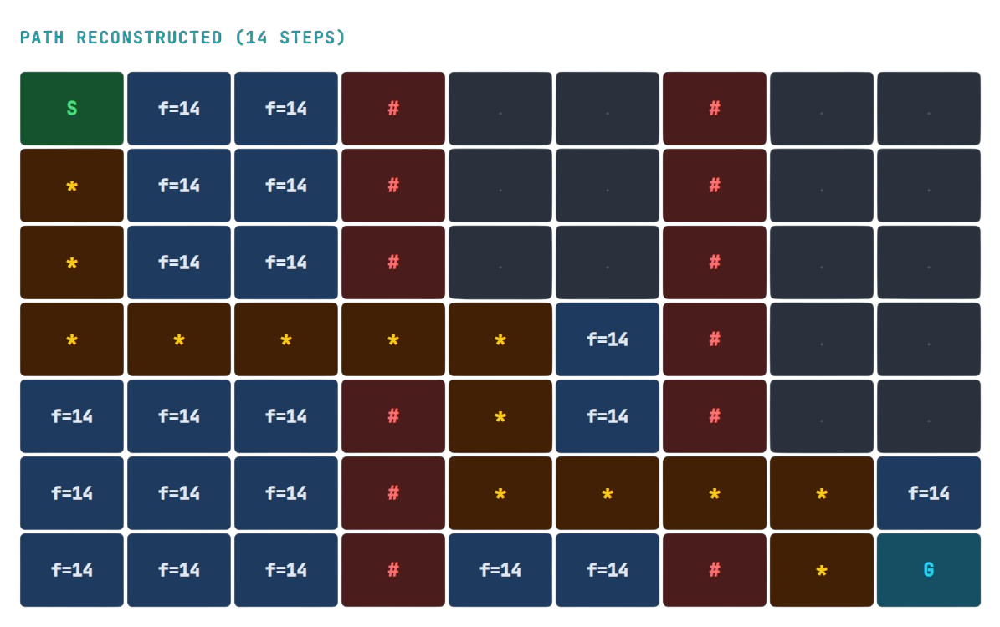

<div align="center">

# A* Pathfinding Algorithm

**A grid-based shortest-path implementation using the A\* search algorithm with Manhattan distance heuristic, written in modern C++14.**

[](https://isocpp.org/)
[](https://visualstudio.microsoft.com/)
[](LICENSE)
[](https://andrewfoxatu.github.io/A-Star-Algorithm-Project/)

[Live Report](https://andrewfoxatu.github.io/A-Star-Algorithm-Project/) · [Features](#features) · [Configuration](#configuration) · [How It Works](#how-it-works)

</div>

---

## Demo



---

## Features

| Feature | Description |
|---|---|
| **Configurable Grid** | Adjustable dimensions, start/goal positions, and obstacle placement |
| **Dual Obstacle Modes** | Fixed maze layout with zigzag walls, or random generation with auto-retry |
| **Manhattan Heuristic** | Admissible and consistent, guaranteeing optimal paths on 4-directional grids |
| **Colour Output** | ANSI-coloured console with box-drawing borders and legend |
| **Test Suite** | 10 validation checks that gate pathfinding execution |
| **Smart Pointers** | All nodes managed via `std::unique_ptr` for automatic memory cleanup |

---

## Configuration

All settings live in the `gridParameters` struct inside [`AStarAlgorithm.h`](AStarAlgorithm.h):

```cpp
static const int width = 25;            // grid columns
static const int height = 25;           // grid rows

std::pair<int, int> start = {0, 0};     // top-left
std::pair<int, int> goal  = {24, 24};   // bottom-right

bool randomObstaclesEnabled = true;     // false = fixed maze layout
int randomObstaclesCount = 240;         // obstacle count for random mode
```

When random mode is active, the program regenerates the grid automatically if no valid path exists, retrying up to 20 attempts before reporting failure.

---

## How It Works

A\* maintains an open list of candidate nodes, always expanding the one with the lowest estimated total cost `f = g + h`:

| Value | Meaning |
|---|---|
| **g** | Actual cost (steps) from start to this node |
| **h** | Heuristic estimate (Manhattan distance) to the goal |
| **f** | `g + h`, used as the priority key. Lower f = higher priority |

The algorithm is **complete** (always finds a path if one exists) and **optimal** (the path found is guaranteed shortest) when the heuristic is admissible.

For a detailed step-by-step walkthrough with algorithm snapshots showing f/g/h values at each stage, see the [Live Report](https://andrewfoxatu.github.io/A-Star-Algorithm-Project/).

---

## Project Structure

```
A-Star-Algorithm-Project/
├── AStarAlgorithm.h       # Declarations: gridParameters, Node, AStarAlgorithm
├── AStarAlgorithm.cpp     # A* implementation, grid population, rendering
├── GridUtils.cpp           # Random obstacle generation
├── Tests.cpp               # 10 validation checks
├── ConsoleColors.h         # ANSI colour constants, Windows console setup
├── main.cpp                # Entry point: tests, pathfinding, display
└── index.html              # GitHub Pages report
```

---

## Test Suite

The test suite runs automatically at startup. If any check fails, the program halts before pathfinding begins.

```
--- Grid Parameter Tests ---
[PASS] Test 1:  Grid dimensions are valid (25x25)
[PASS] Test 2:  Start is within bounds (0, 0)
[PASS] Test 3:  Goal is within bounds (24, 24)
[PASS] Test 4:  All obstacles are within bounds
[PASS] Test 5:  Start is not on an obstacle
[PASS] Test 6:  Goal is not on an obstacle
[PASS] Test 7:  Start and goal are different positions
[PASS] Test 8:  randomObstaclesCount is non-negative
[PASS] Test 9:  randomObstaclesCount is feasible for grid size
[PASS] Test 10: Obstacles are unique

--- Results: 10 passed, 0 failed ---
```

---

## References

- [A\* Search Algorithm, Wikipedia](https://en.wikipedia.org/wiki/A*_search_algorithm)
- [Manhattan Distance (Taxicab Geometry), Wikipedia](https://en.wikipedia.org/wiki/Taxicab_geometry)
- [std::pair, cppreference.com](https://en.cppreference.com/w/cpp/utility/pair)
- [ANSI Escape Code, Wikipedia](https://en.wikipedia.org/wiki/ANSI_escape_code)
- [A\* Pathfinding Algorithm, YouTube](https://www.youtube.com/watch?v=i0x5fj4PqP4)

---

<div align="center">

**Andrew Fox** · ATU Galway · 2026

</div>
